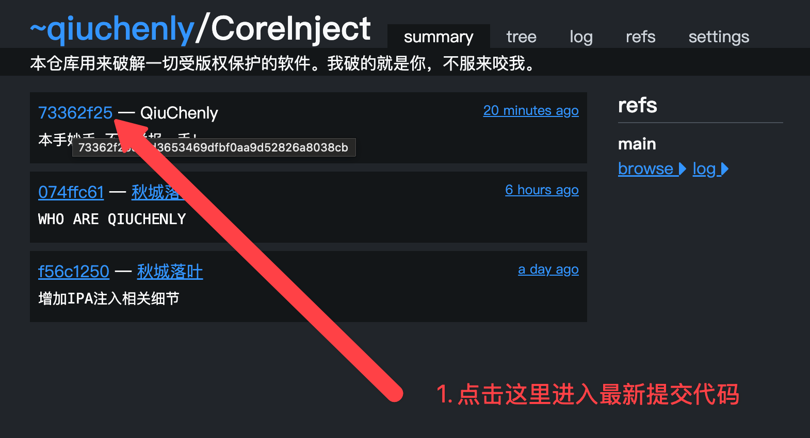
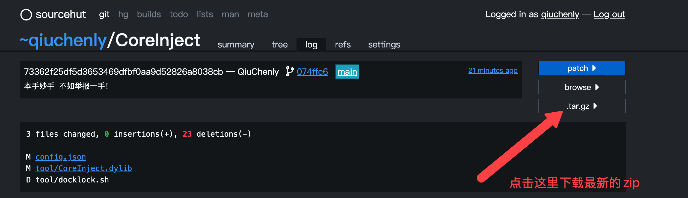

# CoreInject

<div align="center">

<a href="https://github.com/QiuChenly/CoreInject">

</a>

[](https://github.com/QiuChenly/CoreInject/graphs/contributors)
[](LICENSE)
[](https://www.apple.com/macos/)
[](https://www.apple.com/ios/)

**macOS/iOS 集成注入框架**

*基于互联网最原始共享精神的开源项目*

</div>

---

## 📢 重要通知

> ⚠️ **本仓库现在仅作为一个索引，列出三方镜像地址。**
> 
> 为避免被爱好举报维权的此类开发者提供举报理由，现所有源码均镜像于其他服务器。但本页面使用说明等内容仍然有效。

---

## 🚀 快速开始

### 下载方法

1. **点击最新提交**
   

2. **下载最新ZIP包**
   

### 使用Git克隆

```bash
git clone https://git.sr.ht/~qiuchenly/CoreInject --depth=1
```

---

## 🛠️ 使用方法

1. 下载仓库ZIP文件并解压
2. 终端cd到该目录
3. 执行 `秋城落叶_启动.command`
4. 选择你中意的程序注入即可

### 遇到问题？

**选择1：获取即时帮助**
- **Telegram群组**: [https://t.me/+VvqTr-2EFaZhYzA1](https://t.me/+VvqTr-2EFaZhYzA1)
- **QQ群**: 1049674046

**选择2：查看详细文档**
- 📖 [使用文档](https://qiuchenlyopensource.github.io/Documentaions/)

---

## 🎯 现已支持

- ✅ **macOS应用注入**
- ✅ **IPA注入** - [查看详情](./iOSHijack/readme.md)
- 🔄 持续更新中...

---

## 💻 系统要求

| 项目 | 要求 |
|------|------|
| **最低运行版本** | macOS High Sierra 10.13 |
| **编译SDK** | macOS 14.0 |
| **目标部署平台** | macOS 10.13 |
| **CMakeLists环境变量** | `set(CMAKE_OSX_DEPLOYMENT_TARGET "10.13")` |

### 检查二进制文件兼容性

```bash
find . -name "*.*" | xargs otool -l | grep -E "(minos|sdk)"
```

---

## 🌐 服务器镜像地址

**主要镜像**: https://git.sr.ht/~qiuchenly/CoreInject

---

## 🤝 加入社区

### 关注渠道
- 📢 **Telegram频道**: [https://t.me/qiuchenlymac](https://t.me/qiuchenlymac)
- 🐦 **Twitter**: [https://twitter.com/QiuChenly](https://twitter.com/QiuChenly)

### 交流群组
- **Telegram群组**: [https://t.me/+VvqTr-2EFaZhYzA1](https://t.me/+VvqTr-2EFaZhYzA1)
- **QQ群**: 1049674046 *(仅为方便国内用户反馈问题与交流)*

> 💡 **注意**: 加群者请在遵守当地法律法规的前提下进行交流

---

## 🏆 荣誉贡献榜

<div align="center">

<a href="https://github.com/QiuChenly/CoreInject/graphs/contributors">
  
</a>

</div>

---

## 🎮 原神启动！

<div align="center">

[](imgs/bengbuzhule.mp4)

*点击图片进入新世界*

</div>

---

## 📜 项目理念

本项目是**Free的、开源的、基于互联网最原始共享精神的、不接受任何打赏的、无所不包的、令人感叹的、无与伦比的、精妙绝伦的、化腐朽为神奇的、逆天的、养生的、抽象的、二次元的、OP的**。

> 💭 **关于共享精神**: 我认为，共享精神不应该建立在物质上，我深刻的理解金钱对人的吸引和动力，但这种精神本身就超越了物质。

---

## ⚖️ 免责声明

> 📋 **致来自中国大陆的各位学习研究爱好者:**
> 
> 根据大陆中华人民共和国《计算机软件保护条例》第十七条规定："为了学习和研究软件内含的设计思想和原理，通过安装、显示、传输或者存储软件等方式使用软件的，可以不经软件著作权人许可，不向其支付报酬。"
> 
> 您需知晓本仓库所有内容资源均来源于网络，仅供用户交流学习与研究使用，版权归属原版权方所有，版权争议与本仓库本作者无关，用户本人下载后不能用作商业或非法用途，需在24小时之内删除，否则后果均由用户承担责任。

---

## 👨‍💻 关于作者

> 🌟 **我是重生之人。**
> 
> 一觉醒来，全球计算机技术水平下降了一万倍但我不变。原来我重生到了一个同名的人身上，在我醒来的时候，一道灵光从天灵盖中发出，脑海中听到了机械声音在提示我：已激活全球最强程序员系统。
> 
> 我是来自北美的独立iOS应用程式开发者，专注於开发有趣又富有创意的应用。对于法律问题，我只能说明技术原理，不能提供任何法律意见。
> 
> 同时，我也是二次元南桐。从台湾国立大学毕业的那一天，我的青春永远留在了高雄。

---

## 📞 联系方式

对于肆意滥用法律的组织和个人，请将律师函发送至：

**华盛顿特区第35大道林肯大街15号-501, John Albet收**

---

<div align="center">

**🔞全球各❤️地❤️服❤️务🔞**  
**🔞①线至①⑧线城市齐全🔞**  
**🔞汇❤️编 🚗与🤤ASM约❤️会🔞**  
**🔞 一❤️个❤️人独自在家❤️火❤️热❤️难❤️耐 玩🔞逆🔞向 🔞**  
**🔞找Qiu❤️Chen❤️l❤️y❤️Open❤️Source🔞**

---

关注QiuChenly喵，关注落叶的Twitter喵。谢谢大家喵。

